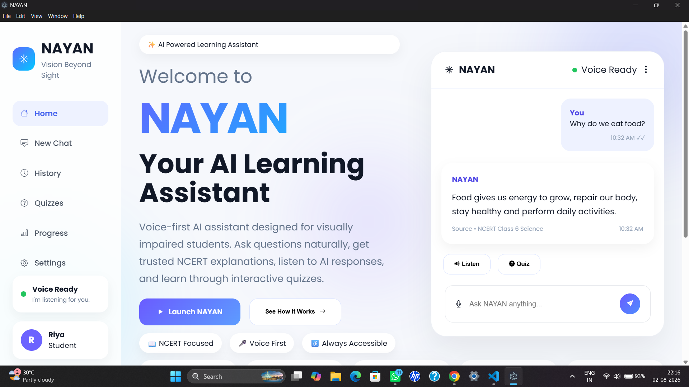
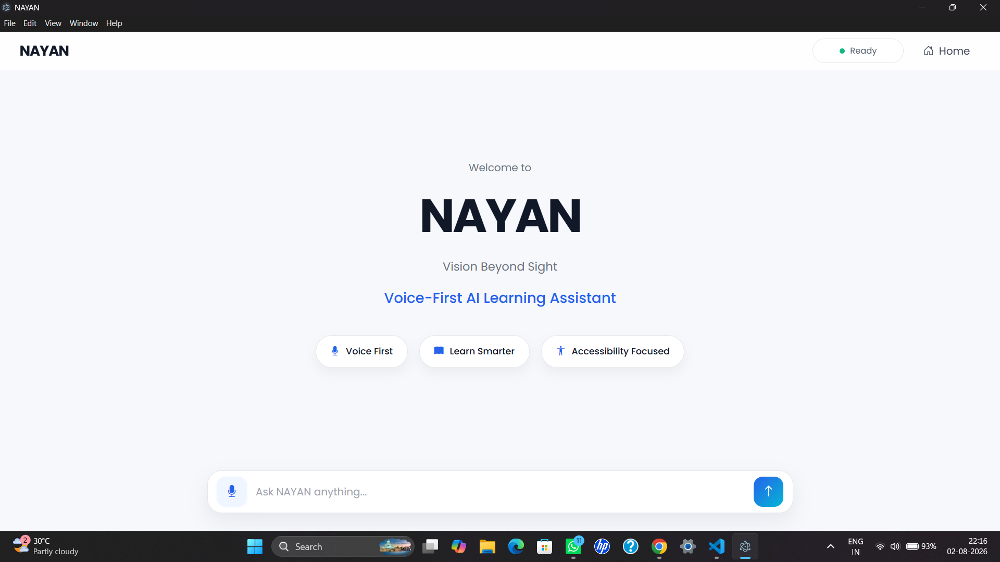
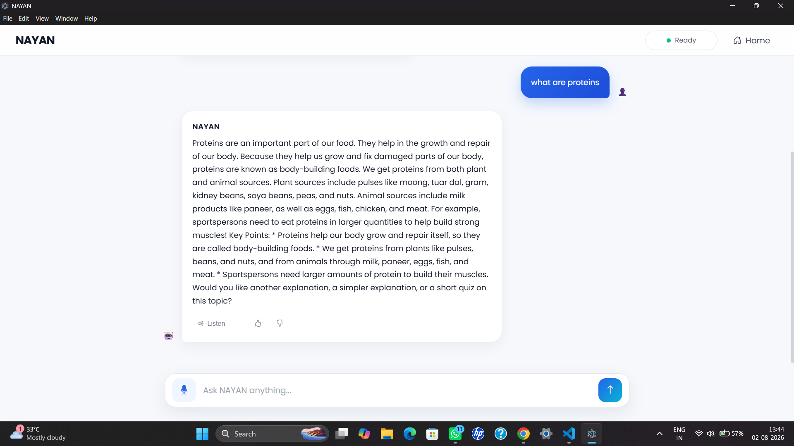
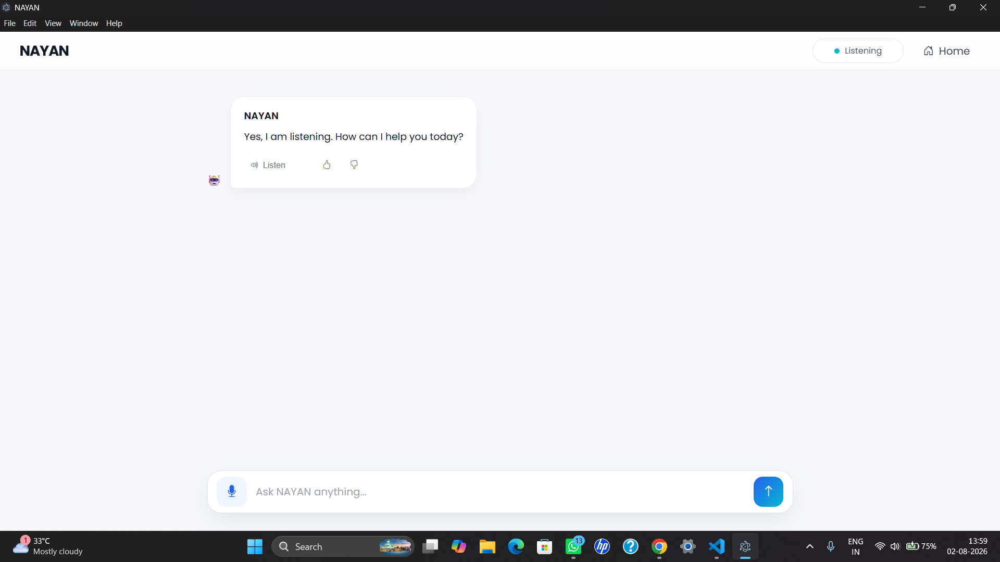
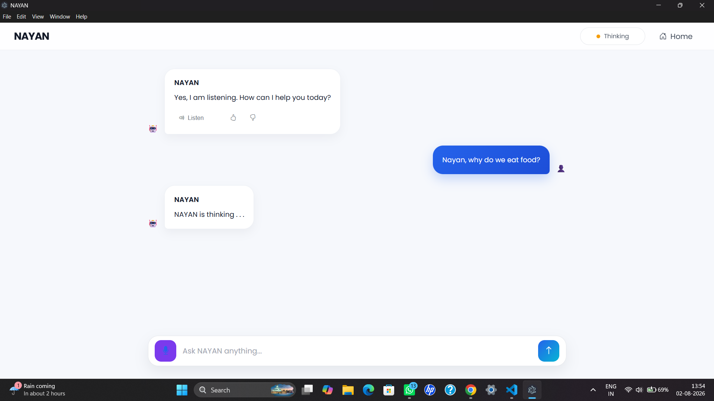
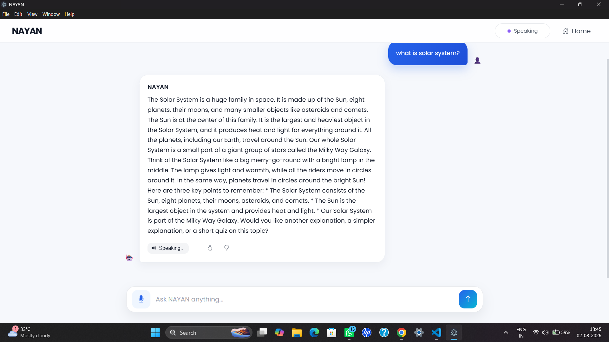

<div align="center">

# NAYAN

### Vision Beyond Sight

### AI-Powered Voice-First Learning Assistant for Visually Impaired Students

Built with Whisper • Gemini • Piper • Electron • FastAPI • RAG


</div>

---

# Overview

NAYAN is an AI-powered desktop learning assistant designed primarily for visually impaired students.

Instead of navigating traditional educational platforms, learners simply speak naturally.

NAYAN listens, understands questions, retrieves relevant educational content, generates contextual responses using Retrieval-Augmented Generation (RAG), and speaks answers back using natural voice synthesis.

The current MVP focuses on **NCERT Class 6 Science**, providing reliable educational assistance through a completely voice-first experience.

---

# Features

## 🎤 Voice-First Interaction

- Wake-word activation
- Continuous conversation
- Hands-free learning
- Natural speech recognition

---

## 🧠 AI Tutor

- Gemini-powered responses
- Context-aware explanations
- Retrieval-Augmented Generation (RAG)
- NCERT focused answers

---

## 🔊 Natural Voice Responses

- Piper Text-to-Speech
- Offline speech synthesis
- Human-like voice output

---

## 📚 Educational Knowledge Base

- NCERT Class 6 Science
- Semantic search using FAISS
- Grounded AI responses

---

## ♿ Accessibility First

Designed specifically for visually impaired learners.

Features include:

- Voice navigation
- Speech feedback
- Minimal interaction required
- Clean accessible interface

---

## 💻 Desktop Application

Built using Electron for a native desktop experience.

---

# Screenshots

## Home Screen



---

## Chat Screen

!

---

## Voice Conversation



---

## Listening State



---

## Thinking State



---

## Speaking State



---

# Architecture

```
                     Hey Jarvis
                          │
                          ▼
                 Wake Word Detection
                          │
                          ▼
                 Electron Desktop App
                          │
          ┌───────────────┴───────────────┐
          ▼                               ▼
     Voice Input                     Chat Interface
          │
          ▼
     Faster Whisper STT
          │
          ▼
      FastAPI Backend
          │
          ▼
   FAISS Retriever (RAG)
          │
          ▼
      Google Gemini API
          │
          ▼
     AI Generated Response
          │
          ▼
      Piper Text-to-Speech
          │
          ▼
          User
```

---

# Tech Stack

## Frontend

- HTML5
- CSS3
- Bootstrap
- JavaScript

## Desktop

- Electron

## Backend

- FastAPI
- Python

## AI/ML

- Faster Whisper
- Google Gemini
- FAISS
- Sentence Transformers

## Voice

- OpenWakeWord
- Piper TTS

---

# Folder Structure

```
NAYAN
│
├── backend/
│
├── electron/
│
├── frontend/
│
├── voice_engine/
│
├── models/
│
├── assets/
│
├── requirements.txt
│
└── README.md
```

---

# Installation

Clone the repository

```bash
git clone https://github.com/yourusername/NAYAN.git
```

Move into the project

```bash
cd NAYAN
```

Install Python dependencies

```bash
pip install -r requirements.txt
```

Install Electron packages

```bash
cd electron
npm install
```

---

# Usage

Run the launcher

```bash
python launcher.py
```

Say

> **Hey Jarvis**

NAYAN launches automatically.

Example questions:

- What are proteins?
- Why do we eat food?
- Explain photosynthesis.
- Repeat that.
- Goodbye.

---

# Conversation Flow

```
User

↓

Wake Word Detection

↓

NAYAN Opens

↓

Greeting

↓

Listening

↓

Speech Recognition

↓

AI Thinking

↓

Gemini + RAG

↓

Voice Response

↓

Listening Again

↓

30 sec idle
↓

"Are you still there?"

↓

60 sec idle
↓

"I'm going to sleep."

↓

Electron closes

↓

Wake-word listener resumes
```

---

# Accessibility

NAYAN has been designed with accessibility as its primary objective.

✔ Voice-first interaction

✔ Speech output

✔ Minimal visual dependency

✔ Hands-free learning

✔ Simple and clean interface

---

# Roadmap

- ✅ Wake-word Detection
- ✅ Faster Whisper STT
- ✅ Piper Text-to-Speech
- ✅ Electron Desktop Application
- ✅ Gemini Integration
- ✅ Retrieval-Augmented Generation
- ✅ Repeat Command
- ✅ Automatic Sleep Mode
- ✅ Voice Conversation

Upcoming

- ⬜ Quiz Module
- ⬜ Learning Progress Tracking
- ⬜ OCR Reader
- ⬜ PDF Learning
- ⬜ Multi-language Support
- ⬜ Offline LLM Support

---
## 🤝 Contributors

<table>
<tr>

<td align="center">

### 👩‍💻 Riya Jayswar

AI/ML Engineer • Frontend Developer • Voice Interaction

Python • Electron • Whisper • Piper • Accessibility

</td>

<td align="center">

### 👩‍💻 Niharika Saroj

Backend & AI/ML Engineer

Python • FastAPI • RAG • FAISS • Gemini • APIs

</td>

</tr>
</table>

---

## 📄 License

This project is licensed under the **MIT License**.

You are free to use, modify, and distribute this software in accordance with the terms of the MIT License.

See the LICENSE file for details.

---

<div align="center">

# 🌟 NAYAN

### *Vision Beyond Sight*

**Making education accessible through AI.**

⭐ If you like this project, consider giving it a star.

</div>
